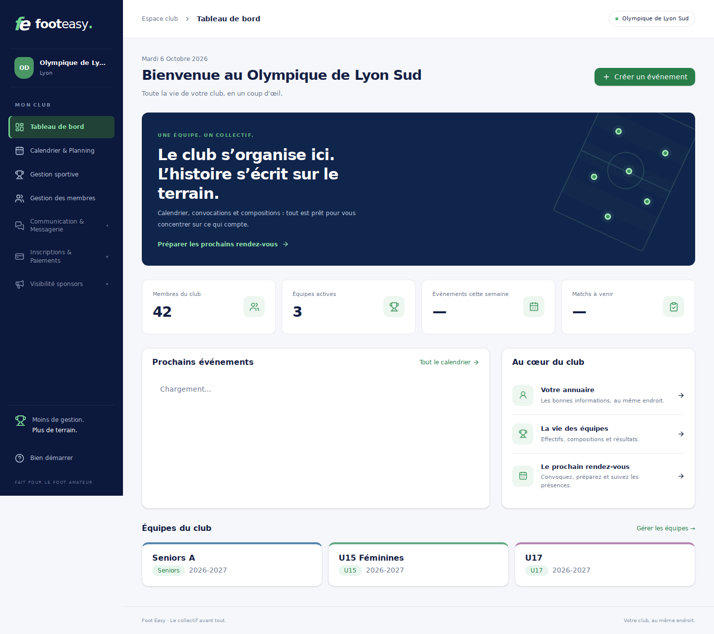
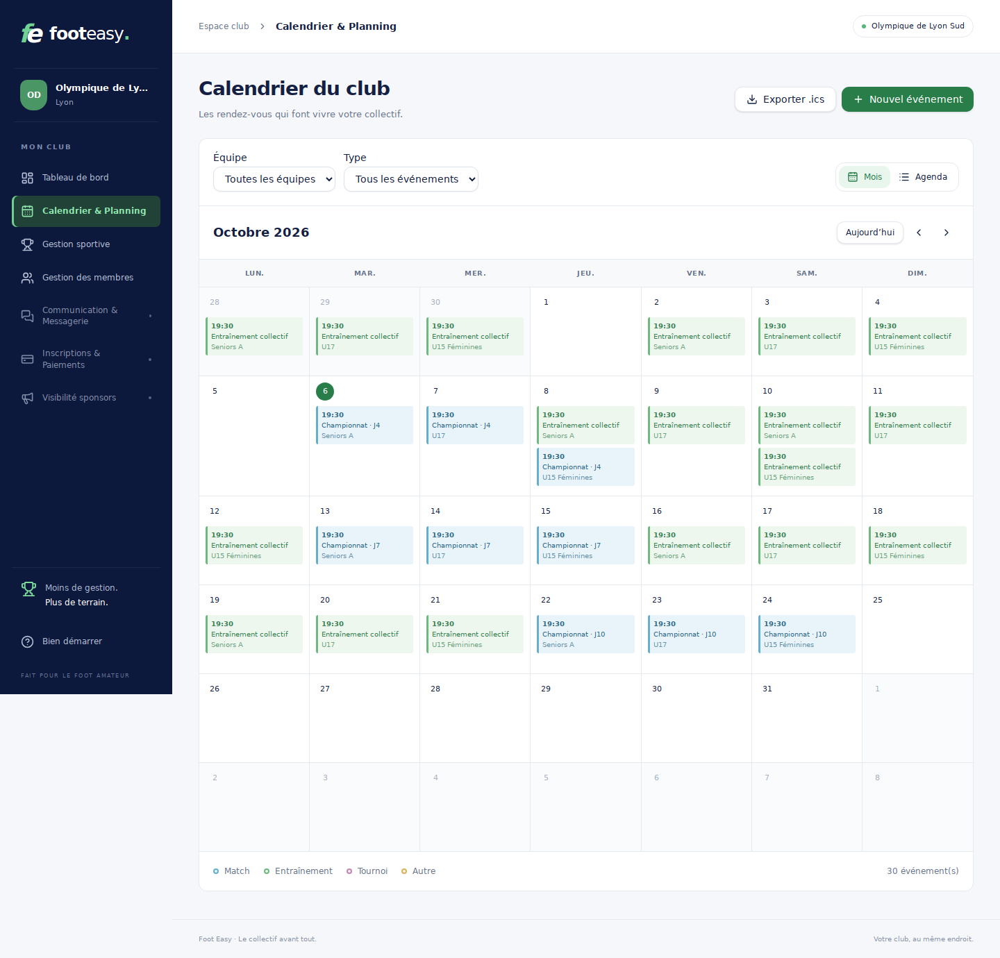

# Foot Easy

Logiciel de gestion de club de football amateur, organisé en modules :

| Module | État |
|---|---|
| Tableau de bord | Vue d'ensemble du club, effectifs, événements de la semaine et prochains matchs |
| Calendrier & Planning | Vues mois / agenda, filtres équipe / type, création, modification, annulation et rétablissement, événements récurrents, export iCalendar |
| Gestion des membres | Annuaire du club, recherche et tri, fiches modifiables (coordonnées, naissance, licence, maillot), import CSV/XLSX par équipe et export CSV filtré |
| Gestion sportive | Équipes, convocations et réponses, relevé des présences réelles, compositions (foot à 11 / 8 / 5), score et faits de match, statistiques et assiduité |
| Tâches d'équipe | Catalogue personnalisé, tâches usuelles, attribution par événement et bilan de la saison |
| Communication & Messagerie · Inscriptions & Paiements · Visibilité sponsors | À développer — périmètre décrit dans [`specs/`](./specs) |

La feuille de route complète (15 épopées, 49 user stories) est dans [`specs/`](./specs) ;
l'organisation en espace club est décrite dans
[ADR-0004](./docs/adr/0004-club-space-and-module-navigation.md).

## Aperçu de l'interface

Captures réalisées avec un club fictif lors de la vérification dans Chromium.





## Stack

| Partie | Technologies |
|---|---|
| `back/` | FastAPI · SQLAlchemy 2 async · Alembic · Postgres · Pydantic v2 · pytest |
| `front/` | Vite · React 19 · TypeScript strict · Tailwind CSS 4 + shadcn/ui · TanStack Query · i18next · Vitest + RTL + MSW |
| Infra locale | docker-compose · Traefik · Postgres · Adminer |

Décisions d'architecture : [`docs/adr/`](./docs/adr).

## Démarrer avec Docker

```bash
cp .env.example .env
docker compose up -d --build
```

| Service | URL |
|---|---|
| Application | http://foot-easy.localhost |
| API + Swagger | http://api.foot-easy.localhost/docs |
| Adminer | http://adminer.foot-easy.localhost |
| Dashboard Traefik | http://traefik.foot-easy.localhost |

Les migrations Alembic sont appliquées au démarrage du conteneur `api`.

## Développer sans Docker

**Backend** (Python ≥ 3.12) :

```bash
cd back
python -m venv .venv && .venv/Scripts/activate   # Windows ; source .venv/bin/activate sinon
pip install -e ".[dev]"
pytest                                            # tests (SQLite en mémoire, voir ADR-0003)
ruff check . && ruff format --check .
DATABASE_URL=postgresql+asyncpg://… alembic upgrade head
uvicorn app.main:app --reload
```

**Frontend** (Node ≥ 20.16, npm uniquement) :

```bash
cd front
npm ci --include=dev
npm run dev            # http://localhost:5173 ; /api est relayé vers localhost:8000
npm test
npm run lint && npm run typecheck && npm run build
```

## Contrat d'API

L'OpenAPI du backend est la source de vérité. Après toute modification d'un endpoint :

```bash
cd back && python -c "import json, app.main as m; print(json.dumps(m.app.openapi(), indent=2))" > openapi.json
cd ../front && npm run api:types
```

Le fichier racine `openapi.json` doit rester identique à `back/openapi.json`.

Les erreurs suivent toujours l'enveloppe `{code, message, errors[], request_id}`.

## Qualité

```bash
pip install pre-commit
pre-commit install --hook-type pre-commit --hook-type commit-msg
pre-commit run --all-files
```

Commits au format Conventional Commits ; chaque PR suit
[`.github/pull_request_template.md`](./.github/pull_request_template.md).

## Parcours disponibles

- L'annuaire charge toutes les pages et met à jour les fiches après chaque modification.
  L'export conserve les filtres actifs ; l'import demande une équipe de destination.
- Dans le calendrier, « Nouvel événement » permet de planifier un rendez-vous ou une série.
  Les séries conservent l'heure locale du navigateur lors du passage heure d'été / heure d'hiver.
  L'export `.ics` contient tous les événements correspondant aux filtres, pas seulement le mois affiché.
- La fiche d'événement sépare la disponibilité annoncée de la présence constatée : à l'heure,
  en retard, excusé, non excusé ou blessé. Les bilans sont invalidés après modification.
- Le catalogue des tâches est accessible depuis l'équipe ou l'événement. Supprimer une tâche
  supprime aussi ses attributions ; une confirmation explicite précise cet effet.
- L'interface reprend les repères des captures : bleu marine, vert, cartes blanches,
  calendrier coloré, annuaire en tableau, bilans et terrain tactique. La navigation est adaptée au mobile.

## Limites avant une mise en production

Les convocations, réponses et compteurs de relance sont enregistrés dans l'API ; aucun
email ni push n'est encore envoyé. L'authentification, les permissions par rôle, les comptes
parents/enfants et le stockage des pièces jointes ne sont pas implémentés. Les données
se rafraîchissent après les actions et au retour dans la fenêtre, sans flux temps réel partagé.
Les écrans communication, paiements et sponsors sont explicitement indiqués comme à venir.

## Sécurité

L'authentification n'est pas encore en place (voir
[ADR-0002](./docs/adr/0002-authentication-deferred.md)) : **ne pas exposer l'API** hors d'un
poste de développement avant la livraison de l'épopée 04.
